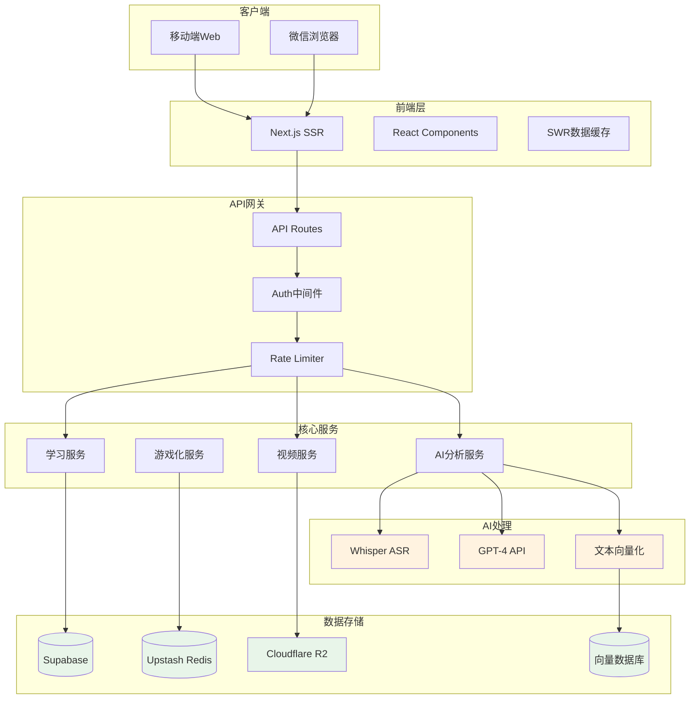
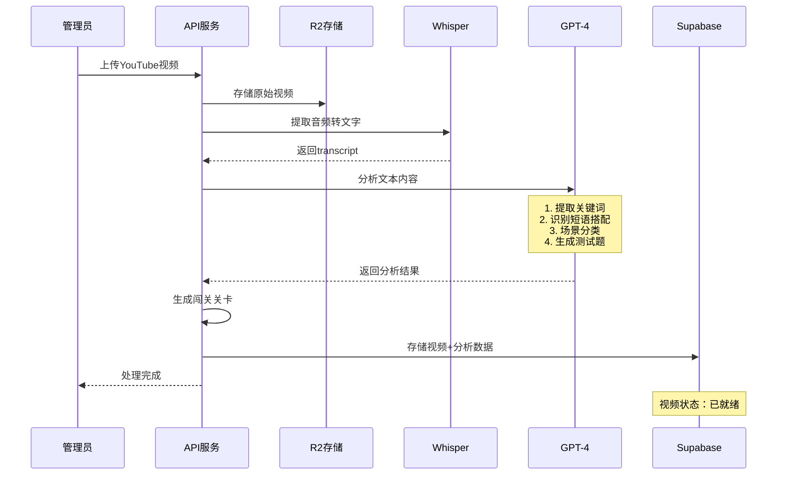

# PRD - 场景英语学习平台

> 生成时间：2024-09-30
> 版本：v1.0.0
> 产品代号：SceneEnglish

---

## 版本更新（Changelog）

### v1.0.0 — 2024-09-30
- **变更摘要**：MVP版本初始化，核心功能包括AI视频分析、智能闯关、抖音式交互
- **核心功能**：30个视频、AI关键词提取、GPT闯关题生成、积分系统
- **技术架构**：Next.js全栈 + Supabase + GPT-4 + Whisper API
- **测试重点**：微信浏览器兼容性、视频加载速度、AI分析准确度

---

## 核心目标（Mission）
通过YouTube真实场景视频+AI智能分析+游戏化闯关，让英语学习像刷抖音一样上瘾且高效。

## 用户画像（Persona）
- **目标用户**：18-35岁大学生和职场新人，小红书活跃用户
- **核心痛点**：背单词枯燥、实际场景不会用、缺乏学习动力、记不住词汇用法
- **使用习惯**：日均刷短视频2小时、碎片时间多、喜欢即时反馈

## V1：最小可行产品（MVP）
- ✅ 30个精选YouTube视频（按难度1-5分级）
- ✅ AI视频分析（提取关键词、短语、场景）
- ✅ AI智能闯关（GPT生成理解测试题）
- ✅ 抖音式视频播放器（上滑切换）
- ✅ 中英双语字幕（AI优化时间轴）
- ✅ 点击暂停 + AI词汇场景解释
- ✅ 用户登录（手机号/微信登录）
- ✅ 学习进度云同步
- ✅ 基础积分系统（观看+答题）
- ✅ 移动端完美适配（特别是微信浏览器）

## V2+：后续版本（Future Releases）
### V2（1个月后）
- ➕ 扩充至100个视频
- ➕ AI对话模拟（基于视频场景）
- ➕ 个性化学习路径推荐
- ➕ 词汇收藏本 + 艾宾浩斯复习
- ➕ 每日学习排行榜
- ➕ 5分钟微课切片模式

### V3（2-3个月后）
- ➕ 200个视频完整库
- ➕ 语音跟读评分
- ➕ 小组学习/好友PK
- ➕ 成就系统 + 徽章墙
- ➕ 导出学习报告
- ➕ 真人外教点评（增值服务）

## 关键业务逻辑（Business Rules）

### R1：AI视频分析规则
- **输入**：YouTube视频文件（mp4）
- **处理**：
  1. Whisper API提取音频转文字
  2. GPT-4分析提取关键信息
  3. 生成闯关题目和场景标注
- **输出**：结构化学习内容（关键词+短语+题目+难度）
- **约束**：视频长度1-13分钟，分析时间<2分钟

### R2：智能闯关规则
- **输入**：视频进度（30%/60%/90%）
- **处理**：展示AI生成的理解测试题
- **输出**：答题结果 + 积分奖励 + 解析
- **约束**：每题限时30秒，答对+20分，答错-5分

### R3：积分系统规则
- **输入**：用户行为（观看/答题/完成）
- **处理**：
  - 每30秒观看：+10分
  - 完整观看：+50分
  - 答对闯关题：+20分
- **输出**：积分余额 + 等级提升
- **约束**：每日上限500分，防刷机制

### R4：会员权限规则
- **输入**：用户类型（免费/付费）
- **处理**：权限判定
- **输出**：
  - 免费：每日3个视频
  - 付费（39.9元）：全部视频永久访问
- **约束**：付费用户支持多设备同步

## 数据契约（Data Contract）

### 用户表 (users)
```sql
- user_id: UUID 主键
- phone: 手机号（unique, 加密存储）
- wechat_openid: 微信OpenID
- nickname: 昵称
- avatar: 头像URL
- level: 等级 (1-10)
- points: 当前积分
- total_points: 历史总积分
- is_vip: 是否付费会员
- vip_expire: 会员过期时间
- created_at: 注册时间
- last_active: 最后活跃时间
```

### 视频表 (videos)
```sql
- video_id: UUID 主键
- title: 标题
- youtube_url: 原始链接
- file_url: OSS存储地址
- duration: 时长（秒）
- difficulty: 难度 (1-5)
- category: 分类（生活/商务/旅行等）
- accent: 口音（美式/英式/澳式）
- transcript_en: 英文字幕(JSON)
- transcript_cn: 中文字幕(JSON)
- ai_analysis: AI分析结果(JSON)
  - keywords: 关键词数组
  - phrases: 短语数组
  - scenarios: 场景标签
- checkpoints: 闯关点(JSON)
- view_count: 观看次数
- created_at: 上传时间
```

### 学习记录表 (learning_records)
```sql
- record_id: UUID 主键
- user_id: 外键
- video_id: 外键
- progress: 进度百分比
- watch_duration: 实际观看时长
- points_earned: 获得积分
- checkpoints_passed: JSON数组
  - checkpoint_id
  - passed: boolean
  - score: 得分
  - attempts: 尝试次数
- words_collected: 收藏的单词
- notes: 学习笔记
- completed_at: 完成时间
- updated_at: 最后学习时间
```

### AI分析缓存表 (ai_cache)
```sql
- cache_id: UUID 主键
- video_id: 外键
- analysis_type: 分析类型
- model_version: 模型版本
- result: 分析结果(JSON)
- created_at: 生成时间
```

## MVP 原型（选定稿：抖音式沉浸学习）

```
┌─────────────[手机屏幕]─────────────┐
│  ≡  场景英语   🏆 积分:320  👤    │
├────────────────────────────────────┤
│                                    │
│         [视频播放区域]              │
│         ▶️ ━━━━━━━━━━━            │
│                                    │
│     "How's the weather today?"    │
│         今天天气怎么样？            │
│                                    │
│    ┌──────────────────────┐       │
│    │ 🔍 AI场景解析        │       │
│    │ weather: 天气(高频)   │       │
│    │ 使用场景：日常问候    │       │
│    └──────────────────────┘       │
├────────────────────────────────────┤
│ ❤️ 280  💬 56  📤 分享  ⭐ 收藏    │
├────────────────────────────────────┤
│ 【AI闯关提示】                      │
│ 30秒后进入第1关                    │
│ GPT定制题目 答对+20积分🎯          │
├────────────────────────────────────┤
│  ⬆️ 上滑切换下一个视频              │
│  点击字幕查看AI解析                │
├────────────────────────────────────┤
│  首页 | 闯关 | 排行 | 词汇本 | 我  │
└────────────────────────────────────┘

AI闯关弹窗：
┌────────────────────────────────────┐
│        🤖 AI场景理解关卡           │
├────────────────────────────────────┤
│ Q: 视频中"grab a coffee"通常用于？ │
│                                    │
│  A. 正式商务邀请                  │
│  B. 休闲社交约会 ✓                │
│  C. 紧急工作安排                  │
│                                    │
│ 💡 AI提示：注意说话者的语气        │
│                                    │
│ [确认答案] 剩余时间: 25s           │
└────────────────────────────────────┘

答题后反馈：
┌────────────────────────────────────┐
│         ✅ 回答正确！+20分         │
├────────────────────────────────────┤
│ 📚 AI知识点解析：                  │
│                                    │
│ "Grab a coffee" 是美式英语中       │
│ 常见的社交邀约用语，比"have       │
│ coffee"更加随意亲切。类似表达：    │
│ • Grab lunch 吃个午饭              │
│ • Grab a bite 随便吃点             │
│                                    │
│ [继续学习] [查看更多例句]          │
└────────────────────────────────────┘
```

## 架构设计蓝图

### 系统架构图（含AI处理流程）



### AI视频处理时序图



## 技术选型与风险

### 技术栈（稳定可靠版）
| 层级 | 技术选择 | 理由 |
|-----|---------|------|
| 前端框架 | Next.js 14 App Router | SSR性能好、SEO友好 |
| UI组件 | Tailwind CSS + Radix UI | 响应式、无障碍 |
| 状态管理 | Zustand | 轻量、TypeScript友好 |
| 视频播放 | Video.js | 功能全、插件多 |
| 数据库 | Supabase | 自带认证、实时订阅 |
| 缓存 | Upstash Redis | Serverless、按需计费 |
| 存储 | Cloudflare R2 | 无出口费用 |
| AI服务 | OpenAI API + Whisper | 效果最好、稳定 |
| 部署 | Vercel | 零配置、自动扩容 |

### 风险评估与对策
| 风险 | 概率 | 影响 | 应对措施 |
|-----|-----|------|---------|
| GPT-4 API成本高 | 高 | 中 | 缓存分析结果、批处理 |
| 视频加载慢 | 中 | 高 | R2+CDN、分片加载 |
| 微信浏览器限制 | 高 | 中 | 充分测试、准备降级方案 |
| 并发量突增 | 中 | 高 | Vercel自动扩容、Redis缓存 |
| AI分析不准确 | 低 | 中 | 人工复核、用户反馈机制 |

## 开发计划（2周MVP）

### 第一周：核心功能
- Day 1-2: 项目搭建、Supabase配置、认证系统
- Day 3-4: 视频播放器、字幕同步
- Day 5-6: AI视频分析Pipeline搭建
- Day 7: 第一批10个视频处理

### 第二周：闯关与优化
- Day 8-9: AI闯关系统实现
- Day 10: 积分系统
- Day 11-12: 移动端适配、微信浏览器优化
- Day 13: 性能优化、缓存策略
- Day 14: 测试、修bug、部署上线

## 测试计划
- **功能测试**：视频播放、字幕同步、闯关流程
- **兼容测试**：iOS/Android、微信/浏览器
- **性能测试**：视频加载时间<3秒
- **AI测试**：关键词准确率>85%
- **压力测试**：100并发用户

## 成功指标
- 技术指标：页面加载<2秒、视频加载<3秒
- 用户指标：次日留存>40%、平均学习时长>15分钟
- 商业指标：付费转化率>5%

---

**文档状态**：已完成 ✅
**下一步**：开始技术开发
**负责人**：产品 + 技术团队