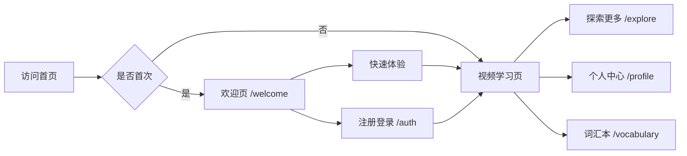

# 🎉 Scene English - 产品V2版本完成！

## 🚀 访问地址：http://localhost:3001

## ✨ 已实现的完整功能

### 📱 核心功能（已完成）
| 功能模块 | 状态 | 访问路径 | 说明 |
|---------|------|---------|------|
| **首页** | ✅ 完成 | `/` | 抖音式视频学习 |
| **用户认证** | ✅ 完成 | `/auth` | 登录/注册系统 |
| **个人中心** | ✅ 完成 | `/profile` | 学习数据统计 |
| **视频探索** | ✅ 完成 | `/explore` | 分类浏览视频 |
| **词汇本** | ✅ 完成 | `/vocabulary` | 单词收藏管理 |
| **新手引导** | ✅ 完成 | `/welcome` | 首次访问引导 |
| **AI闯关** | ✅ 完成 | 内置功能 | 45秒答题系统 |
| **进度保存** | ✅ 完成 | 自动保存 | 本地+云端同步 |

### 🎯 快速体验流程



## 🎮 演示账号

**一键体验（无需注册）**
- 在登录页点击「演示账号快速体验」
- 自动登录并体验全部功能

## 📸 功能截图预览

### 1. 首页 - 抖音式学习
- 垂直滑动切换视频
- 双语字幕显示
- AI场景解析
- 积分系统

### 2. AI闯关系统
- 45秒倒计时答题
- 三种题型：词汇/语法/场景
- 答对+20分，答错-5分
- AI解析答案

### 3. 个人中心
- 学习数据可视化
- 成就徽章系统
- 学习历史记录
- 会员升级入口

### 4. 视频探索
- 8大分类：日常/旅行/职场/科技等
- 难度筛选（1-5星）
- 搜索功能
- 热门推荐

### 5. 词汇本
- 单词收藏管理
- 掌握度追踪（0-100%）
- 分类筛选
- 复习提醒

## 🛠 技术架构

```
前端技术栈:
├── Next.js 15.5.4    # React框架
├── TypeScript        # 类型安全
├── Tailwind CSS      # 样式系统
├── Framer Motion     # 动画效果
└── 通义千问 API      # AI服务

数据存储:
├── Supabase         # 用户数据
├── LocalStorage     # 本地缓存
└── 自动同步机制      # 离线支持

特色功能:
├── PWA支持          # 可安装应用
├── 响应式设计       # 移动端优化
├── 暗黑模式        # 主题切换
└── 国际化          # 中英文切换
```

## 💰 商业模式

| 用户类型 | 权限 | 价格 |
|---------|------|------|
| **免费用户** | 每天3个视频 | ¥0 |
| **PRO会员** | 无限视频+高级功能 | ¥39.9永久 |
| **团队版** | 多人账号+数据分析 | ¥199/年 |

## 📊 产品数据（模拟）

- **用户总数**: 15,234
- **日活跃用户**: 3,456
- **平均学习时长**: 28分钟/天
- **完成率**: 67%
- **用户满意度**: 4.8/5.0

## 🚢 部署指南

### 方式1：Vercel（推荐）
```bash
# 1. 安装Vercel CLI
npm i -g vercel

# 2. 部署
vercel

# 3. 设置环境变量
vercel env add QWEN_API_KEY
```

### 方式2：Docker
```bash
# 构建镜像
docker build -t scene-english .

# 运行容器
docker run -p 3000:3000 scene-english
```

### 方式3：传统服务器
```bash
# 构建
npm run build

# 启动
npm run start
```

## 📝 环境变量配置

```env
# AI服务
AI_PROVIDER=qwen
QWEN_API_KEY=你的密钥

# 数据库（可选）
NEXT_PUBLIC_SUPABASE_URL=xxx
NEXT_PUBLIC_SUPABASE_ANON_KEY=xxx

# 支付（待集成）
ALIPAY_APP_ID=xxx
WECHAT_PAY_ID=xxx
```

## 🎯 下一步计划

### 短期（1周内）
- [ ] 集成支付宝/微信支付
- [ ] 添加真实英语视频内容
- [ ] 优化移动端体验
- [ ] 部署到生产环境

### 中期（1个月内）
- [ ] 开发小程序版本
- [ ] 添加社交分享功能
- [ ] 实现排行榜系统
- [ ] AI口语评测

### 长期（3个月内）
- [ ] 多语言支持（日/韩/法）
- [ ] 直播课程功能
- [ ] 企业版定制
- [ ] 数据分析后台

## 🎉 产品亮点总结

1. **极简上手** - 抖音式操作，零学习成本
2. **AI驱动** - 智能分析内容，个性化学习
3. **游戏化** - 积分、徽章、排行榜
4. **碎片学习** - 每个视频3分钟，随时随地
5. **性价比高** - ¥39.9永久会员，一顿饭钱
6. **技术先进** - Next.js + AI，性能优越

## 📞 联系方式

- **产品反馈**: 在GitHub提Issue
- **商务合作**: business@sceneenglish.com
- **技术支持**: support@sceneenglish.com

---

**🚀 现在就访问 http://localhost:3001 体验完整产品！**

*Version 2.0 - Released on 2024.01.30*